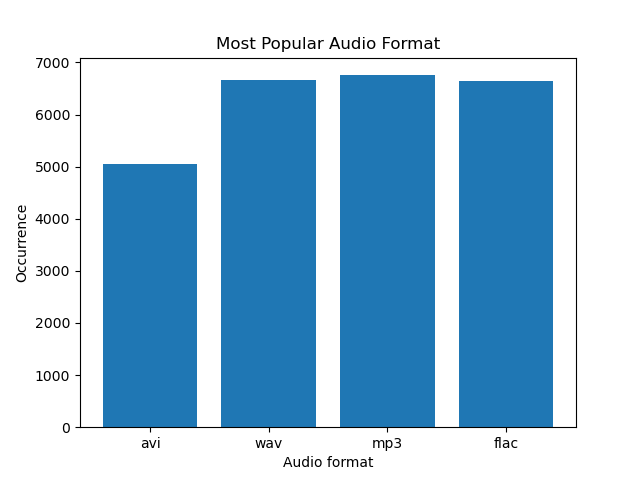
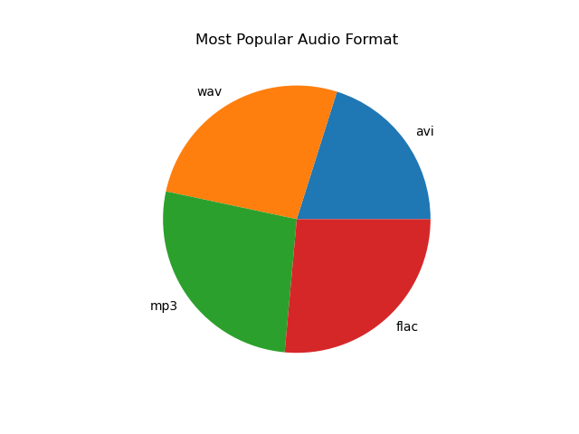
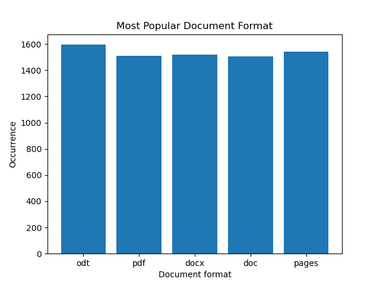
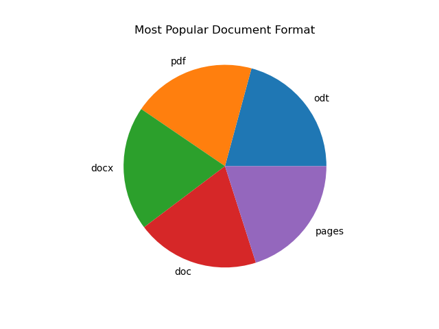
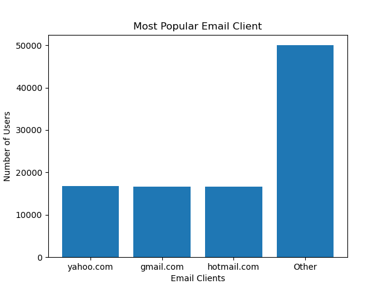
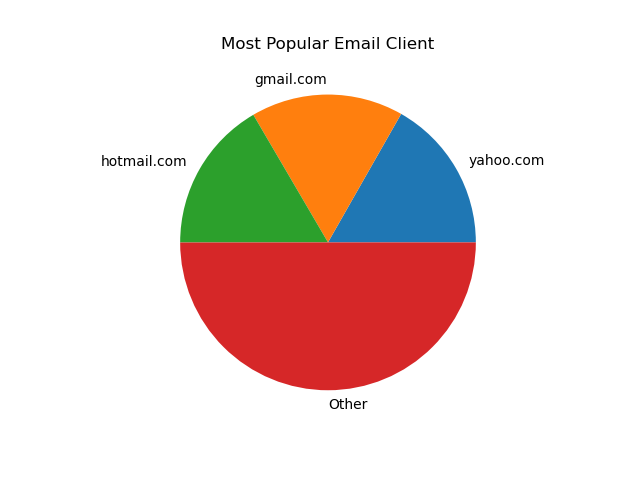
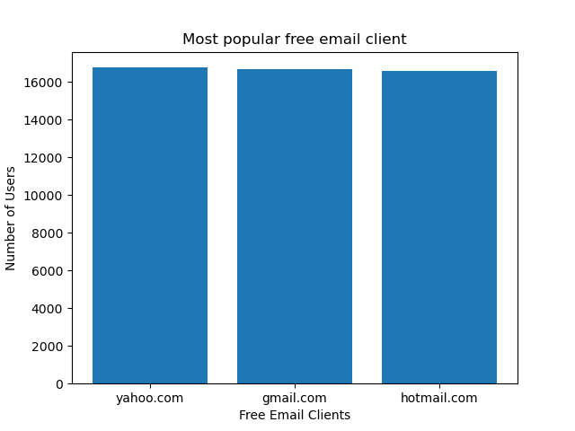
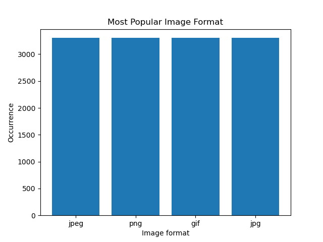
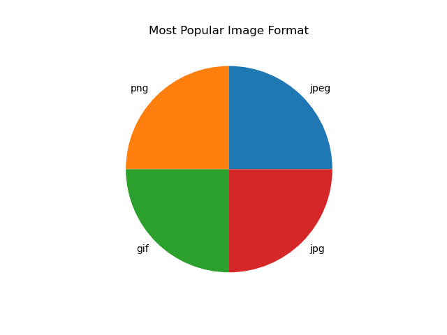

# Table of Contents

* [Introduction](#introduction)
* [Set up the Test](#set-up-the-test)
* [The Test](#the-test)
* [License](#license)
* [Troubleshooting](#troubleshooting)

# Introduction
This test is a conglomeration of multiple python scripts that I would typically
use to run some analysis on data I collected. For this case the data was randomly
generated by using the python package `Faker`. The example data used for this analysis
is stored in the `/data` directory of this repository as `data.csv`. I use the variety
of python scripts to analyze the data. Here is a list of each python scripts with a short
description of what each one does:

* **`analysis`:** Run a series of analyses on some data I collected
* **`fakedatagen`:** Create fake data for testing (if you want to make your own)
* **`fragmentor`:** Split a `.csv` file into smaller chunks.
* **`graphgen`:** Create graphs based on the `xml` data generated by `analysis`

Where GNU parallel comes into play is that `data.csv` has 100,000 entries in it,
and I want to speed up the analysis. Therefore, I wrote `fragmentor` in order to
break the file into smaller chunks and then use GNU parallel to run my analysis in
parallel. This is where `analysis` comes into play. After it has analyzed the chunk
it was given, it creates an `xml` entry. That `xml` entry is then written to a `.xml` file.
`graphgen` then takes in those `.xml` files, parses the data, and then generates the
relevant graphs. The graphs are then put into a `zip` archive that can then be
download to a local machine.

# Set up the Test
## Prerequisites
In order for this test to work properly, there are two things that you will need to do first:

1. [Initialize the conda package manager](#initialize-the-conda-package-manager)
2. [Promise to cite GNU parallel](#promise-to-cite-gnu-parallel)

**NOTE:** If you have already initialized the conda package manager and you have promised to cite GNU parallel in your research paper, then you can go ahead and skip straight to the installation step!

### Initialize the conda package manager
Before you can start working with Anaconda on RHEL7, you need to set up shell support. Luckily, this is pretty easy to do in bash! All you need to do is using the following commands:

```bash
$ module load anaconda3/2020.07
$ conda init bash
$ source ~/.bashrc
```

If conda initialized itself correctly, you should see `(base)` next to your user name in the terminal. You are now ready to start using the conda package manager to install conda packages!

### Promise to cite GNU parallel
It's important to give credit where credit is do right? Well the developers of GNU parallel would love to get some credit when you publish your research paper. The developers will also reference your paper in the next release of GNU parallel. That being said, you need to promise that you will cite GNU parallel in your research paper before you can use it. Luckily, this is pretty easy! All you need to do is use the following commands:

```bash
$ module load gcc/8.3.1
$ module load parallel/20190222
$ parallel --citation
```

You will then be taken through a simple, interactive dialogue. Just enter `will cite` when you are prompted, hit enter on your keyboard, and now you are ready to start using GNU parallel!

## Installation
Setting up the testing environment is very easy! All you need to do is use the
`setup.sh` file that is included in this repository. All you need to do is use
the following commands:

```bash
$ cd ~/work
$ git clone https://github.com/NucciTheBoss/python_gnu_parallel_test_roar.git
$ cd python_gnu_parallel_test_roar
$ bash setup.sh
```

**IMPORTANT:** You need to clone the `python_gnu_parallel_test_roar` repo into your
`work` directory in order for the installer to work correctly.

What this installer will do is create the conda environment needed for the test
and create the `analysis`, `fakedatagen`, `fragmentor`, and `graphgen` executables.
The script will provide you with the path that you need to add to your `PATH`
environment variable in order to use the executables.

**NOTE:** Should you ever want to create your own fake data to use with this test then just use the following commands:

```bash
$ export PATH=${HOME}/work/python_gnu_parallel_test_roar/bin:${PATH}
$ fakedatagen -c <integer> -o </desired/output/path/file.csv> 
```

# The Test

* [Activating the python_gnu_parallel environment](#activating-the-python_gnu_parallel-environment)
* [Submitting a batch job](#submitting-a-batch-job)

## Activating the python_gnu_parallel environment
Let's say that you have a conda package that you want to add to your environment.
This test here is to verify that you can successfully load the `python_gnu_parallel`
environment and install a simple package. Use the following commands to conduct the test:

```bash
$ module load anaconda3/2020.07
$ conda activate python_gnu_parallel
$ conda install -c conda-forge tabulate
$ python -c "from tabulate import tabulate"
```

If there are no error messages received then the test is a success!

## Submitting a batch job
Time to run the analysis! Simply use the following commands in order to submit
the job:

```bash
$ cd ~/work/python_gnu_parallel_test_roar
$ qsub analysis.pbs
```

The job should only take a few minutes to complete thanks to GNU parallel.
Just make sure that you are a member of the `wff3_b_g_bc_default` allocation.
Once the job has finished you should be able to find the file `analysis_output.zip`
and the directory `analysis_output` in your work directory. The graphs will be
stored in `analysis_output`. There will be 10 graphs in total. They should look 
the following (if you use the default `data.csv` file):

* [Most Popular Audio Format Bar Graph](#most-popular-audio-format-bar-graph)
* [Most Popular Audio Format Pie Chart](#most-popular-audio-format-pie-chart)
* [Most Popular Document Format Bar Graph](#most-popular-document-format-bar-graph)
* [Most Popular Document Format Pie Chart](#most-popular-document-format-pie-chart)
* [Most Popular Email Client Bar Graph](#most-popular-email-client-bar-graph)
* [Most Popular Email Client Pie Chart](#most-popular-email-client-pie-chart)
* [Most Popular Free Email Client Bar Graph](#most-popular-free-email-client-bar-graph)
* [Most Popular Free Email Client Pie Chart](#most-popular-free-email-client-pie-chart)
* [Most Popular Image Format Bar Graph](#most-popular-image-format-bar-graph)
* [Most Popular Image Format Pie Chart](#most-popular-image-format-pie-chart)

#### Most Popular Audio Format Bar Graph


#### Most Popular Audio Format Pie Chart


#### Most Popular Document Format Bar Graph


#### Most Popular Document Format Pie Chart


#### Most Popular Email Client Bar Graph


#### Most Popular Email Client Pie Chart


#### Most Popular Free Email Client Bar Graph


#### Most Popular Free Email Client Pie Chart


#### Most Popular Image Format Bar Graph


#### Most Popular Image Format Pie Chart


If your graphs look like the above then the test was a success!

# License
This repository is licensed under the GNU General Public License v3.0. 
For more information on what this license entails, please feel free to 
visit https://www.gnu.org/licenses/gpl-3.0.en.html

# Troubleshooting
If you encounter any issues with the code in this repository while 
testing the RHEL7 nodes then please contact Jason at either jcn23@psu.edu 
or at iask@ics.psu.edu
